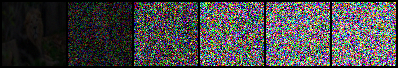
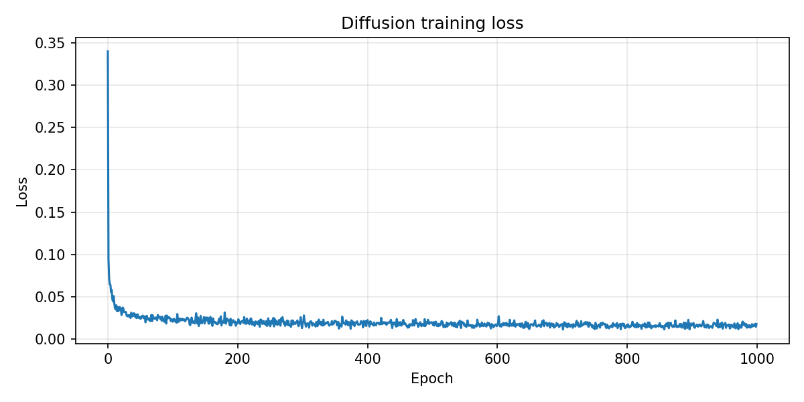
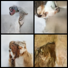
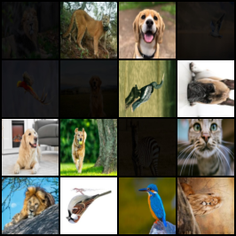
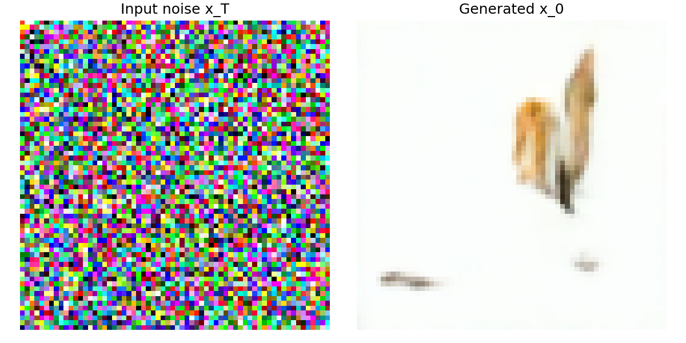

# DDPM — Denoising Diffusion Probabilistic Model from Scratch

Diffusion models work by gradually adding Gaussian noise to a training image until nothing recognizable remains, then training a neural network to reverse this process step by step. Once the network can reliably remove noise at any given noise level, you can start from pure random noise and progressively denoise it until a coherent image emerges.

This project implements the full DDPM pipeline from scratch in PyTorch to generate 64×64 animal images from pure Gaussian noise.

## The Problem

Generative modeling asks: given a training distribution of images, can we sample new images that look like they came from that same distribution? Older approaches like GANs are notoriously unstable to train. Diffusion models solve this by turning generation into a learned denoising problem — much more stable and principled.

Training data: 5 animal classes (~400 images total). Small dataset intentionally — the goal is to understand the mechanism, not scale.

## The Math in Plain Terms

**Forward process** — controlled corruption. Given a clean image x₀, add noise in T=1000 tiny steps following a linear β schedule. The key formula lets you jump directly to any noise level:

```
xₜ = √ᾱₜ · x₀ + √(1 - ᾱₜ) · ε,   ε ~ N(0, I)
```

Where `ᾱₜ = Π βᵢ` is the cumulative noise schedule. At t≈0, the image is almost clean. At t≈T, it is pure noise. The square roots are what make this variance-preserving — total signal energy stays bounded throughout.

**Network's job** — given a noisy image xₜ and the timestep t, predict the noise ε that was added. The loss is simple MSE:

```
L = ‖ε - ε_θ(xₜ, t)‖²
```

**Reverse process** — at inference, start from pure noise x_T and repeatedly apply the learned denoiser, stepping from t=T down to t=0.

## Architecture — Timestep-Conditioned U-Net

The noise predictor is a U-Net: an encoder-decoder with skip connections that preserve spatial detail across scales. The critical addition is timestep conditioning — the network must know *how noisy* the input is to predict noise correctly.

Timestep `t` is embedded using sinusoidal functions (same idea as positional encoding in Transformers), then injected as a bias into each residual block of the U-Net. Without this, the network would be guessing noise level blind.

**x₀-clipping during sampling**: during reverse diffusion, predicted x₀ is clipped to [-1, 1] before computing the posterior mean. This prevents accumulated denoising errors from causing samples to diverge — a small but important stabilization.

## Training Details

| Parameter | Value |
|---|---|
| Image size | 64 × 64 |
| Timesteps T | 1000 |
| β schedule | Linear (0.0001 → 0.02) |
| Optimizer | AdamW |
| LR schedule | Cosine annealing |
| Augmentation | Horizontal flip, color jitter |
| Dataset | ~400 images, 5 animal classes |

## Results

### Forward Noise Process

The forward process grid shows x₀ progressing to pure noise across timesteps. The image fades gradually and uniformly — evidence that the β schedule is correctly implemented:



### Training Loss Curve

Loss dropped from ~0.34 to ~0.011 over training:



### Generated Samples

Starting from pure Gaussian noise, the reverse diffusion process produces these samples:





### Single Sample Demo



The generated images show recognizable animal-like structure. With only ~400 training images, some blurriness and abstraction is expected and documented — the model is learning the distribution shape but not sharp texture details at this data scale.

## How to Run

```bash
pip install torch torchvision pillow matplotlib
```

**Organize your dataset:**
```
animal_data/
  <ClassName>/
    *.jpg
```

**Train:**
```bash
python BSCS22008_05.py train --data_dir /path/to/animal_data
```

**Sample from a trained checkpoint:**
```bash
python BSCS22008_05.py sample --checkpoint saved_models/diffusion_model.pt --num_samples 4
```

Generated images are written to `results/`.

**Run inference on a saved checkpoint:**
```bash
python test_inference.py --checkpoint saved_models/diffusion_model.pt
```

**Interactive single-sample demo:**

Open `test_single_sample.ipynb` in Jupyter to step through the denoising process visually.
